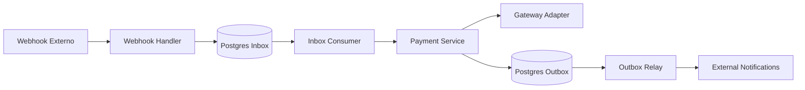

# Asaas Framework - Motor de Pagamentos Industrial

Este projeto é um **Motor de Pagamentos (Payment Engine)** de alta performance e resiliência, construído seguindo os princípios da **Arquitetura Hexagonal**. Ele foi projetado para integrar gateways de pagamento (inicialmente focado no Asaas) com garantias de entrega e processamento confiável.

## 🚀 O que é este projeto?

O framework atua como uma camada intermediária resiliente entre sua aplicação e os provedores de pagamento. Ele resolve problemas comuns em sistemas financeiros, como:
- Perda de eventos (webhooks) por instabilidade do servidor.
- Duplicidade de processamento (Idempotência).
- Falhas de rede ao comunicar com gateways externos.
- Falta de visibilidade (rastreabilidade) em transações complexas.

---

## 🛠️ Principais Funcionalidades (Features)

### 1. Inbox Pattern (Processamento Confiável de Webhooks)
O framework não processa webhooks diretamente na requisição HTTP. Em vez disso:
- **Ingestão**: O webhook é salvo imediatamente no banco de dados (`Inbox`) com status `PENDING`.
- **Consumo**: Um worker assíncrono processa esses eventos em background, garantindo que nenhum evento seja perdido e permitindo retentativas em caso de falha.

### 2. Outbox Pattern (Eventos de Saída Garantidos)
Sempre que o sistema precisa notificar o mundo exterior sobre uma mudança de estado:
- O evento é persistido na tabela `Outbox` na mesma transação atômica da mudança de estado do banco.
- Um relay busca esses eventos e os despacha, garantindo a entrega *at-least-once*.

### 3. Resiliência com Circuit Breaker
Implementa o padrão **Circuit Breaker** (Disjuntor) para proteger o sistema contra falhas em cascata. Se o gateway de pagamento (ex: Asaas) estiver instável, o motor "abre o circuito" e evita sobrecarregar o provedor ou degradar a performance da aplicação local.

### 4. Arquitetura Hexagonal (Ports & Adapters)
Código altamente testável e desacoplado:
- **Domínio**: Contém as regras de negócio e entidades.
- **Ports**: Interfaces que definem como o motor interage com o mundo exterior (DB, Gateways).
- **Adapters**: Implementações concretas de bancos de dados e APIs de gateways.

### 5. Observabilidade (OpenTelemetry)
Suporte nativo a trace distribuído e métricas. Cada processamento de evento carrega o contexto do trace (W3C Trace Context), permitindo rastrear o caminho de um pagamento desde o recebimento do webhook até a finalização.

### 6. Multi-Provider Registry
Sistema de registro flexível que permite acoplar múltiplos gateways de pagamento e alternar entre eles ou rodar de forma híbrida.

---

## 💾 Adaptores de Banco de Dados

Atualmente, o framework possui suporte oficial para:

- **PostgreSQL**:
  - Utiliza o driver `lib/pq`.
  - Implementa recursos avançados como `SKIP LOCKED` para concorrência segura em workers.
  - Suporta tipos de dados específicos como `JSONB` para metadados e `UUID` para identificadores.
  - Implementa particionamento de tabelas (ex: na `Outbox`) para escalar com grandes volumes de dados.

> **Nota**: Devido à dependência de recursos específicos como `JSONB` e `PARTITION BY`, o adaptador atual é otimizado para PostgreSQL.

---

## 📂 Estrutura do Projeto

- `adapters/`: Implementações concretas (Asaas API, Postgres DB).
- `domain/`: Núcleo do negócio (Entidades e Interfaces/Ports).
- `internal/core/`: Lógica central do motor (Serviços e Workers).
- `cmd/`: Pontos de entrada da aplicação.
- `engine.go`: Ponto de partida para inicializar o framework.

---

## 📊 Fluxo de Dados

