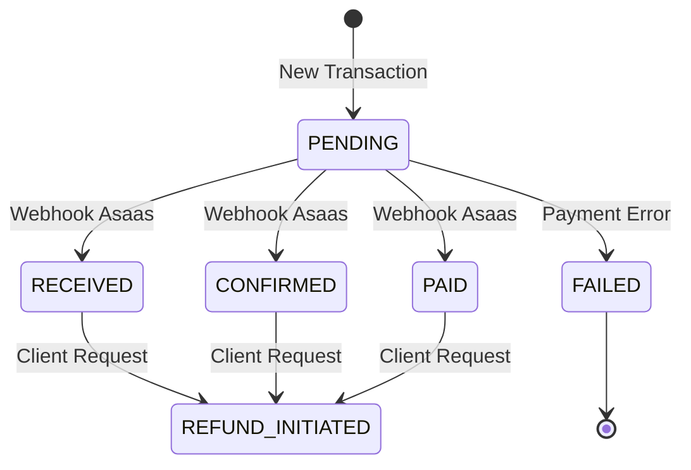

# Documentação de Estrutura: Domínio de Pagamento (FSM)
**Caminho:** `internal/domain/payment`

Esta documentação detalha a lógica de negócio central para a gestão do ciclo de vida de um pagamento. O projeto utiliza o padrão de **Máquina de Estados Finita (FSM - Finite State Machine)** para garantir que as transições de status ocorram de forma previsível, segura e auditável.

---

## 1. O Conceito de Máquina de Estados (FSM)

No contexto financeiro, um pagamento não pode mudar de qualquer status para qualquer outro de forma desgovernada (ex: um pagamento que era "PENDENTE" pode falhar ou ser pago, mas não sofrer estorno imediato antes). A FSM encapsula essas regras, impedindo erros lógicos que poderiam causar inconsistências financeiras graves.

---

## 2. Detalhamento de Funções e Métodos

### A. Construtor e Inicialização

#### `NewPaymentFSM(tx *entity.Transaction) *paymentFSM`
*   **O que faz:** Cria uma nova instância da máquina de estados associada a uma transação específica.
*   **Objetivo:** Isolar a transação dentro de um contexto de execução controlado. Ao passar o ponteiro da entidade `Transaction`, garantimos que as modificações de status feitas pela FSM sejam refletidas no objeto original que será persistido.

---

### B. Gestão de Contexto

#### `SetMetadata(metadata map[string]string)`
*   **O que faz:** Armazena um mapa de strings (chave-valor) dentro da instância da FSM, nativamente serializável para campos JSONB no PostgreSQL.
*   **Objetivo:** Enriquecimento de Eventos. Esses metadados carregam o rastro das operações de OpenTelemetry (Trace Context + Baggage) e outras propriedades contextuais (ex: timestamp original do Asaas) persistindo-as entre os processos assíncronos.

---

### C. Lógica de Transição

#### `TransitionTo(next entity.PaymentStatus) (*entity.OutboxEvent, error)`
Este é o método mais vital do domínio de pagamento. Ele orquestra mecanicamente a mudança lógica de estado, previne conflitos e emite o payload correto para difusão na rede de microsserviços do sistema (via Outbox Relays).

*   **O que faz:** 
    1. Verifica a neutralidade: *O estado alvo é igual o estado atual? Se for, é no-op.*
    2. Compara com os fluxos restritivos para o status atual (`f.tx.Status`).
    3. Se houver falha ilógica, emite o estado emergencial `StatusAnomaly`.
    4. Se sucesso legal, atualiza o status de memória e gera um `OutboxEvent` atômico.
*   **A Mecânica do OutboxEvent Emitido:** 
    *   No Asaas Framework, a criação do **OutboxEvent** nesse domínio exige três elementos absolutos arquitetônicos:
        1. **Gerador Espontâneo Seguro:** Identificador do Outbox Event, gerado pela biblioteca garantida `uuid.New().String()`.
        2. **Rastros:** Metadados originados de `SetMetadata()`.
        3. **Correlacionamento Físico de Domínio (O Payload):** Retornado em sintaxe JSON `[]byte(f.tx.ID)`, para que o Worker consiga relacionar estritamente o evento que saiu da caixa de saída à transação local do banco de dados que sofreu a mutação.

---

## 3. Regras Atuais de Transição (Business Rules)

Atualmente, o domínio suporta as sequências integradas do Asaas:

> [!NOTE]
> Eventos geram mutações na tabela *transactions*, e subsequentemente lançam registros na tabela *outbox* que serão roteados ou tratados localmente pela estrutura arquitetural.

| Status Atual | Status Destino | Resultado | Evento Outbox Gerado | Payload do Evento |
| :--- | :--- | :--- | :--- | :--- |
| **PENDING** | **PAID**, **RECEIVED**, **CONFIRMED** | Sucesso | `PAYMENT_CONFIRMED` | *`tx.ID` Real* |
| **PENDING** | **FAILED** | Sucesso | `PAYMENT_FAILED` | *`tx.ID` Real* |
| **PAID / RECEIVED / CONFIRMED** | **REFUND_INITIATED** | Sucesso | `REFUND_STARTED` | *`tx.ID` Real* |
| *Qualquer caso ilegal* | *Qualquer outro* | Dispara `ANOMALY` | `PAYMENT_ANOMALY` | Warning String |

---

## 4. Por que esta lógica é robusta?

1.  **Proteção contra Estados Inválidos:** O domínio trava os pagamentos em fluxos lógicos e evita que atualizações corrompam as flags financeiras.
2.  **Identidade Garantida do Evento de Outbox:** Integrado ao FSM, nenhum evento sai viciado para a tabela de notificações — todos são garantidos pelo ID UUID autônomo da classe do google util.
3.  **Comunicação Universal Atômica Baseada em IDs Repassados:** Nenhuma máquina precisa reler ou adivinhar qual o conteúdo. Um `tx.ID` claro entra e guia o barramento.

---

> [!TIP]
> **Dica de Evolução:** Sempre que a integração com o Asaas cobrar respostas ou webhooks variados de estado, mapeie as constantes (`asaas_translator.go`), e introduza a via de fluxo lógico correspondente para o status base nos "switch/cases" desse arquivo!
