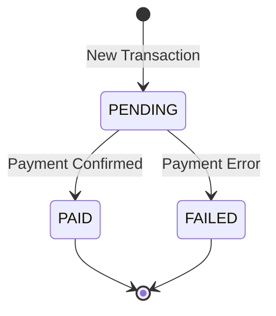

# Documentação de Estrutura: Domínio de Pagamento (FSM)
**Caminho:** `internal/domain/payment`

Esta documentação detalha a lógica de negócio central para a gestão do ciclo de vida de um pagamento. O projeto utiliza o padrão de **Máquina de Estados Finita (FSM - Finite State Machine)** para garantir que as transições de status ocorram de forma previsível, segura e auditável.

---

## 1. O Conceito de Máquina de Estados (FSM)

No contexto financeiro, um pagamento não pode mudar de qualquer status para qualquer outro (ex: um pagamento já "PAGO" não pode voltar para "PENDENTE"). A FSM encapsula essas regras, impedindo erros lógicos que poderiam causar inconsistências financeiras graves.

---

## 2. Detalhamento de Funções e Métodos

### A. Construtor e Inicialização

#### `NewPaymentFSM(tx *entity.Transaction) *paymentFSM`
*   **O que faz:** Cria uma nova instância da máquina de estados associada a uma transação específica.
*   **Objetivo:** Isolar a transação dentro de um contexto de execução controlado. Ao passar o ponteiro da entidade `Transaction`, garantimos que as modificações de status feitas pela FSM sejam refletidas no objeto original que será persistido.

---

### B. Gestão de Contexto

#### `SetMetadata(metadata map[string]string)`
*   **O que faz:** Armazena um mapa de strings (chave-valor) dentro da instância da FSM.
*   **Objetivo:** Enriquecimento de Eventos. Esses metadados geralmente contêm informações contextuais (ex: ID da requisição, motivo da falha, origem do dispositivo) que serão incluídas nos eventos gerados, facilitando a depuração e auditoria posterior.

---

### C. Lógica de Transição

#### `TransitionTo(next entity.PaymentStatus) (*entity.OutboxEvent, error)`
Este é o método mais importante do domínio de pagamento. Ele orquestra a mudança de estado e a geração de efeitos colaterais.

*   **O que faz:** 
    1. Verifica o status atual da transação (`f.tx.Status`).
    2. Valida se a transição para o `next` status é permitida pelas regras de negócio.
    3. Se permitida, atualiza o status na entidade.
    4. Gera e retorna um `OutboxEvent` correspondente.
*   **Parâmetros:**
    *   `next`: O status de destino desejado (ex: `entity.StatusPaid`).
*   **Retorno:**
    *   `*entity.OutboxEvent`: Uma "promessa" de notificação que descreve a mudança ocorrida.
    *   `error`: Caso a transição seja ilegal (ex: tentando pagar algo já falho).
*   **Objetivo de Negócio:** Integridade e Notificação. O objetivo é garantir que toda mudança de estado bem-sucedida resulte na criação automática de um evento. Esse evento será usado pelo padrão Outbox para avisar outros sistemas sobre a mudança, sem o risco de "mudar o status mas esquecer de avisar a rede".

---

## 3. Regras de Transição (Business Rules)

Atualmente, o sistema implementa as seguintes regras estritas:

| Status Atual | Status Destino | Resultado | Evento Gerado |
| :--- | :--- | :--- | :--- |
| **PENDING** | **PAID** | Sucesso | `PAYMENT_CONFIRMED` |
| **PENDING** | **FAILED** | Sucesso | `PAYMENT_FAILED` |
| **PAGO / FALHO** | *Qualquer outro* | Erro | Nenhum (Lança Excpetion) |

---

## 4. Por que esta lógica é robusta?

1.  **Proteção contra Estados Inválidos:** O domínio "trava" o pagamento em fluxos válidos. Isso evita, por exemplo, que um webhook atrasado marque um pagamento como "FALHO" se ele já tiver sido marcado como "PAGO" por outro processo.
2.  **Desacoplamento de Infraestrutura:** A FSM não sabe como os dados são salvos ou como o dinheiro é cobrado. Ela apenas decide se a mudança de estado faz sentido logicamente.
3.  **Garantia de Efeitos Colaterais:** Ao retornar um `OutboxEvent` no mesmo método da transição, o framework força o desenvolvedor (ou a camada de aplicação) a lidar com esse evento, garantindo que a comunicação com o resto do ecossistema seja mantida.

---

> [!TIP]
> **Dica de Evolução:** Sempre que uma nova regra de negócio surgir (ex: permitir Reembolso), ela deve ser adicionada primeiro no `switch` do método `TransitionTo` dentro deste arquivo, garantindo que o coração do sistema valide a regra antes que qualquer código de infraestrutura seja escrito.
