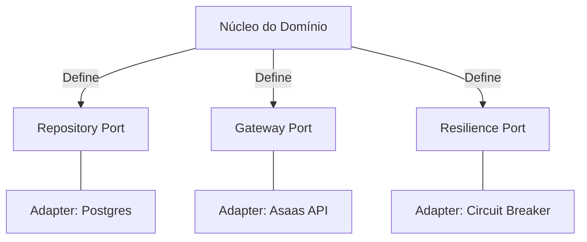

# Documentação de Estrutura: Camada de Ports
**Caminho:** `internal/domain/port`

Esta documentação detalha as interfaces (Ports) localizadas no núcleo do domínio do projeto `asaas_framework`. Em uma Arquitetura Hexagonal, os **Ports** definem os contratos que o domínio exige do mundo externo, garantindo que a lógica de negócio permaneça isolada de detalhes de infraestrutura (como bancos de dados ou APIs de terceiros).

---

## 1. Visão Geral dos Ports

Os arquivos nesta pasta definem como o sistema se comunica com persistência, gateways de pagamento e mecanismos de resiliência.

---

## 2. Detalhamento dos Arquivos

### A. `repository_port.go`
Este arquivo define a interface `Repository`, que é responsável por toda a persistência de dados e garantia de consistência transacional.

#### Principais Funcionalidades:
1.  **Padrão Inbox/Outbox (Resiliência de Mensagens):**
    *   `SaveInboxEvent` / `SaveOutboxEvent`: Persistem eventos recebidos ou a serem enviados. Isso garante que, se o sistema cair após salvar no banco mas antes de processar/enviar, o evento não será perdido.
    *   `ClaimInboxEvents` / `ClaimOutboxEvents`: Utilizam a estratégia de **Phase A: Claim**. Geralmente implementado com `SKIP LOCKED` no SQL para que múltiplos workers possam processar eventos em paralelo sem colisões.
    *   `FinalizeInboxEvent` / `FinalizeOutboxEvent`: **Phase C: Finalize**. Marca o evento como processado com sucesso ou falha.

2.  **Operações de Domínio:**
    *   `GetTransactionByID`: Recupera uma transação específica para processamento.
    *   `SaveTransaction`: Persiste o estado atual de uma transação de pagamento.

3.  **Transações ACID:**
    *   `ExecuteInTransaction`: Este é um dos métodos mais críticos. Ele permite que o domínio execute múltiplas operações (ex: salvar transação + salvar evento outbox) dentro de uma única unidade de trabalho atômica. Se qualquer uma falhar, tudo sofre rollback.

---

### B. `gateway_port.go`
Define como o sistema interage com provedores de pagamento externos (ex: Asaas) e como lida com a idempotência.

#### Interfaces Definidas:
1.  **`GatewayAdapter`**:
    *   `CreateCustomer`: Registra um cliente no provedor externo.
    *   `CreateTransaction`: Cria a cobrança/pagamento no provedor.
    *   `GetTransactionState`: Consulta o status atual de uma transação no provedor para sincronização.
    *   `RefundTransaction`: Solicita o estorno de um pagamento.

2.  **`IdempotencyStore`**:
    *   Essencial para APIs financeiras. Garante que a mesma operação não seja executada duas vezes (ex: evitar cobrança duplicada se houver um retry de rede).
    *   `IsProcessed`: Verifica se uma chave de idempotência já foi utilizada.
    *   `SaveProcessed`: Registra que uma chave foi processada com sucesso.

3.  **`WebhookHandler`**:
    *   `Handle`: Processa notificações assíncronas enviadas pelo provedor (ex: "Pagamento Confirmado"). Recebe o payload bruto e a assinatura para validação de segurança.

---

### C. `resilience_port.go`
Foca na estabilidade do sistema ao lidar com falhas externas.

#### Interface `CircuitBreaker`:
Implementa o padrão de **Disjuntor** para evitar que o sistema continue tentando fazer chamadas a um serviço externo que está fora do ar ou lento.

*   `Allow`: Verifica se a requisição pode ser feita. Se o disjuntor estiver "Aberto", a chamada é bloqueada imediatamente (Fail Fast).
*   `RecordResult`: O domínio reporta se a chamada teve sucesso ou erro. O disjuntor usa isso para decidir se deve abrir ou fechar.
*   `GetState`: Retorna se o estado é `CLOSED` (operando normalmente), `OPEN` (bloqueando chamadas) ou `HALF_OPEN` (testando recuperação).

---

## 3. Por que isso é robusto?

1.  **Desacoplamento Total:** O domínio não sabe que existe um PostgreSQL ou a API do Asaas. Ele apenas sabe que precisa de um `Repository` e um `GatewayAdapter`. Isso facilita testes unitários com Mocks.
2.  **Garantia de Entrega:** O uso de Inbox/Outbox dentro da interface de repositório força qualquer implementação a lidar com a persistência de eventos, garantindo consistência eventual entre microsserviços ou sistemas externos.
3.  **Segurança Financeira:** A separação da `IdempotencyStore` garante que a lógica de "não cobrar duas vezes" seja uma regra de primeira classe no design do sistema.
4.  **Auto-preservação:** O `CircuitBreaker` incluído como port demonstra que a resiliência não foi um "puxadinho", mas parte integrante do contrato de comunicação do domínio.

---

> [!NOTE]
> Todos os métodos descritos aqui são contratos. Suas implementações concretas residem na pasta `internal/infra`, mantendo o "Núcleo Limpo" seguindo os princípios de Clean Architecture.
